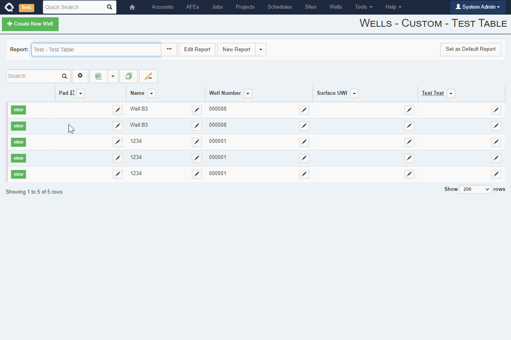

If you've ever found yourself looking at a report in Execute's browse screen and thought to yourself, 'Gosh, that ain't right.  I need to update that!', only to be slightly deterred by the prospect of actually opening the Well, AFE, Job, etc. to make the change... Have we got a thing for you!  

Users can now update individual values or entire columns right from the browse screens throughout Execute! 

From the browse screen, users can now click the toolbar's pencil icon to enable bulk edit mode.  This puts a pencil in each *editable* cell in your browse report which will allow updating the cell without leaving the report.  In addition, the new "Bulk Update" option under the column dropdown allows a user to update the entire column (respecting any filters you have, of course).  

This new functionality respects the user's edit permissions and will only allow updates to data they could have changed normally.

Here is a quick demo:

