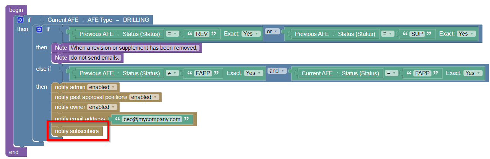

When configuring email reminders and notifications, administrators can now...

* Allow users to **opt-out** of receiving the notification/reminder by setting the `Allow Opt-Out` field on the notification/reminder to "Yes" (by default, users are not able to opt-out of reminders/notifications that they are included in)
* Allow users to **opt-in** to receiving the notification/reminder by adding the new `notify subscribers` block to the reminder's Recipients rule.  i.e. 

Users are then able to adjust their email preferences from the new "Email Preferences" menu item under their name in the top-right of the Execute screen.

