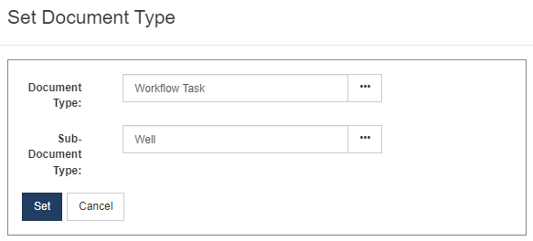
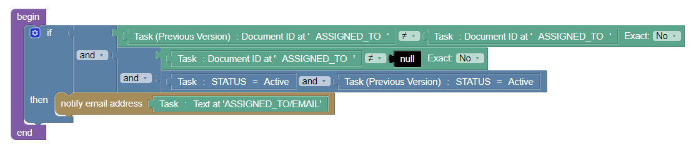

When creating a new Notification or Reminder, administrators can now use the new "Workflow Task" document type to build custom notifications for workflow tasks which much greater control than was previously available.

These new notification types allow building more complex rules like:

To help get you started, we've created a new sample notifications for the Job (RTx) module:

Note: There is currently a known issue that makes it impossible to build notifications when a task assigned to a user is reactivatd.  We are aware of this and working on a fix in a coming release.
