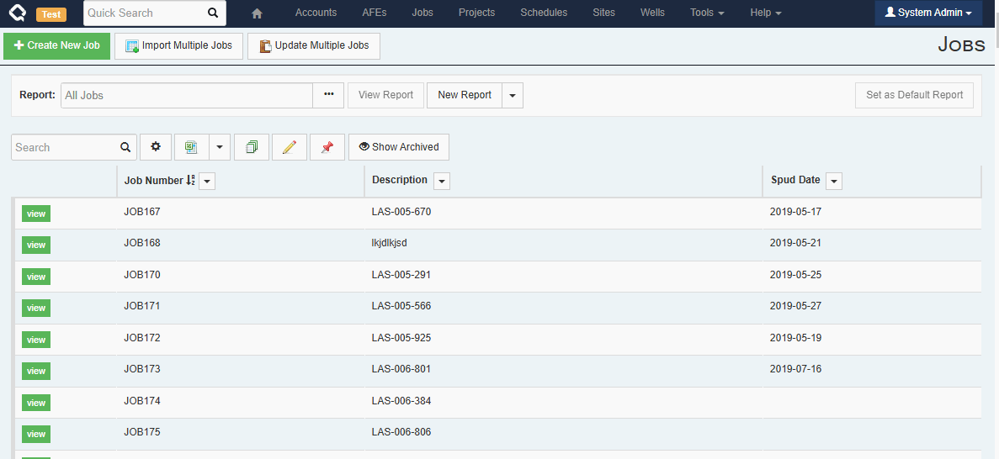
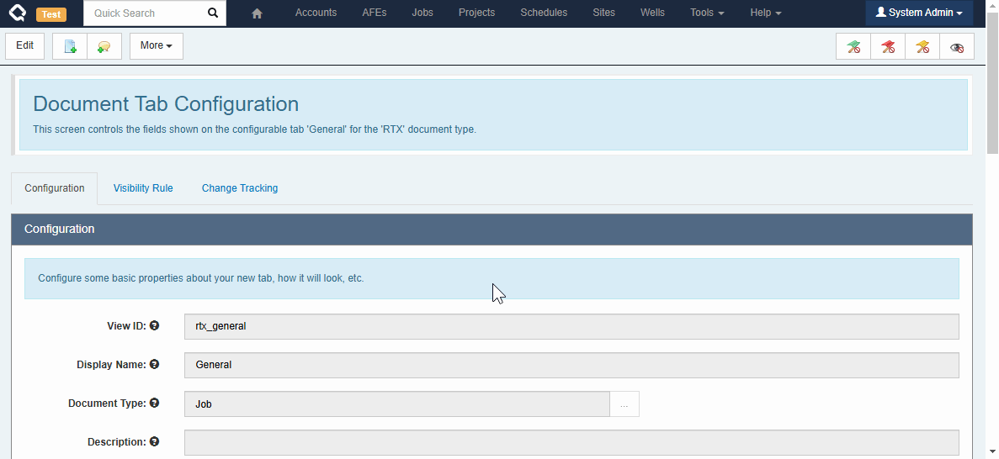
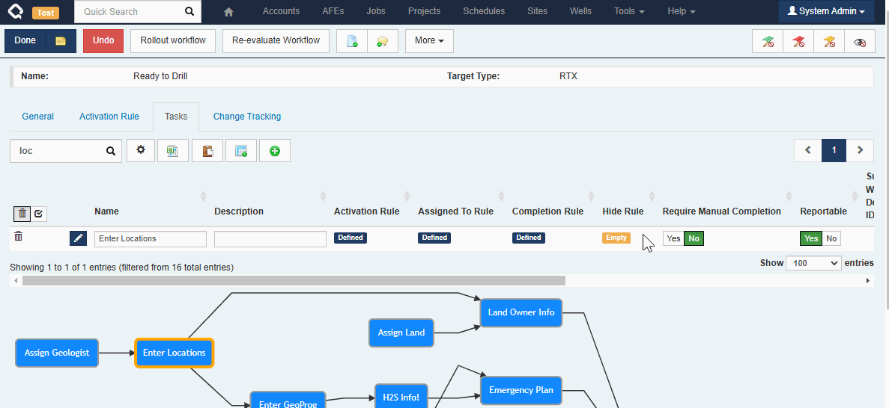
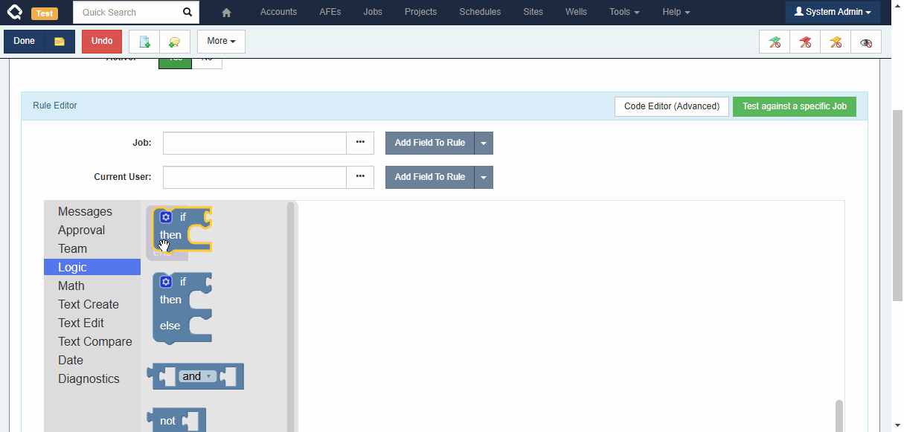

In many places throughout Execute, information from linked documents can now be included without requiring you to build calculated fields, etc.  The examples below are primarily around Wells, Jobs and Pads but the functionality is available across any for any record type in Execute.

## Browse Reports (User Facing)

Using our new column picker, everyone can now build reports that include/reference data from related documents.

Here is a quick example showing how to include Well and Pad-level fields on a Job report.  

We always strive to minimize non-admin/end-user-facing changes to avoid the need to retrain users.  In this case, while there is a visible change for the end-user, we hope the change is small and obvious enough that it won't cause any confusion.

## Custom Tabs

Administrators can also include fields from related documents when building custom tabs. For example, a Job custom tab can include fields from the linked Well or Pad for reference. 

**Note that currently, these referenced fields are NOT editable (i.e. you can't edit a Well field from the Job), but we're working on that!**

## Workflow Tasks

Administrators can include fields from related documents on workflow tasks. For example, a Job-level workflow task can include fields from the Job, the Job's Well, and the Job's Well's Pad! Unlikely Custom Tabs, these fields are all editable (assuming the user has the appropriate permissions).

## Custom Business Rules (Blockly)

And, finally, you can do this when building custom business rules using Blockly too!

Execute used to offer similar functionality for specific references using our "Reference Fields" dropdowns. These fields have been replaced by the new (more capable) functionality, and any existing rules using the old Reference Fields should have been automatically updated to the new structure*.

> Note: The old Reference Fields did allow building some references which we consider problematic because their behaviour was unpredictable. We have removed support for these problematic relationship types. Existing rules will continue to work as they did before, but it will no longer be possible to create new rules of these types.
>
> The following relationships are no longer supported.
> 1. Project > Well
> 2. Project > Site
> 3. Site > Well
> 4. Well > Job
> 5. Site > Job
>
> For clarity, the way to read an entry like "Well > Job" in the above list is that *it is not valid for a Well-level report, workflow task, report, etc., to refer to a Job-level field*. The reason is that a Well often contains more than one Job, and as soon as more than one Job is referenced, it is impossible to show a single value for a linked Job-level field. Previously, we allowed rules to be built like this, but they would silently stop working as soon as more than one Job was linked.