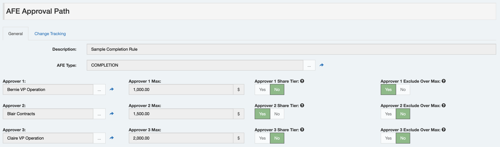
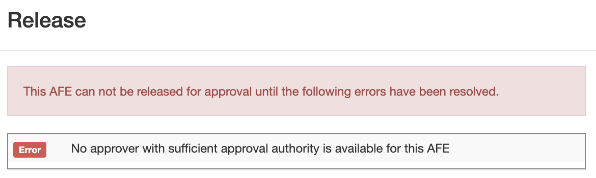
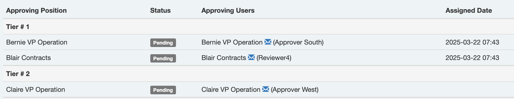
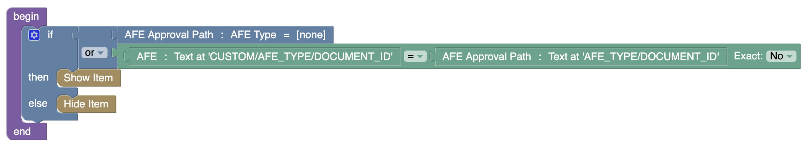

# AFE Approval/Review Paths

This release introduces a new out-of-the-box way to defined approval rules in Execute called **AFE Approval Paths**, and the same for system review called **AFE Review Paths**.

## What are they?

Paths are a new **option** for modeling approval/review rules in Execute.

This feature introduces two new document-types ("AFE Approval Path" and "AFE Review Path") that can be used to define different paths of individuals an AFE can flow through for approval and review.

For the remainder of this document, we'll talk about Approval Paths but, for the most part, Review Paths are the same (except they don't have $ limits).

Here is a sample Approval Path that defines a 3 approver approval path for completion AFEs.

Next, an Approval Path is selected for an AFE (using the AFE's new `APPROVAL_PATH` field). This selection can be entirely manual (which may be a great low-setup-effort option), "smart-manual" (using list filters to limit selection to valid approval paths which the user can then choose from - i.e. here are the three options for drilling AFEs), or "full-auto" (using a list filter setup to always identify a single Approval Path for each AFE with no user interaction needed).

When releasing the AFE for approval, Execute will look at the Approval Path linked to the AFE and add those approvers to the AFE. 

A couple key notes, however...

* Approval Paths specify individuals and not positions.  This makes building the rules far easier for those of you who think in these terms.  Execute does require positions, however, so we automagically create them as required.
* These are meant to be a simpler option, not a replacement for Blockly.  While they have a bunch of great functionality (maximum approval authority, tiers, and exclude-if-over-max), they can't do everything that the more powerful Blockly rules can.

## Why are they?

Our current approval rules are great, but there are a few aspects of them that are problematic for some customers.

1. They are complex.  Some companies struggle with describing their approval rules as "individual positions with a blockly-based should-I-approve-this-AFE rules".
2. Many companies think of approvals as "Bob is authorized to approve up to $2M", which is difficult to think model in Execute's Blockly-based rules where, instead, you need to add a rule to the person after Bob that says "Bob's boss sees everything above $2M".
3. Some companies really struggle to think in terms of approving positions.  They think in terms of individual people.
4. Some companies have their approval rules defined in another system and want to leverage that.  It is very difficult to automate the creation / management of current Execute approval rules.

So...

Approval Paths give another option which will be easier to work with and maintain for some companies.

As a bonus.  Because Approval Paths are simple "Documents" in Execute...

* You can report on them
* You can update them with Browse Edit mode
* You can import them / update them from Excel
* You can load them with Data Loaders
* You can load/update them automatically with Document Sync
* You can easily create/manage them with our APIs

## How do I turn them on?

1. You should enable the `APPROVAL_PATH` field on the AFE and, somehow, provide a mechanism for it to be set.
    * (Easiest) Add the field to an AFE custom tab and have someone fill it in.  If that's too open, you can always use list filters to limit which Approval Paths can be picked based on attributes of the AFE (the default is filtering by AFE Type).
    * (Harder) Automate the selection.  Make the `APPROVAL_PATH` editability `Never Except Batch` and ensure the Blockly List Filters are setup to always identify a single Approval Path for each AFE (Execute will then automagically attach it).
2. You need to give your admin user the "Manage AFE Approval Paths" privilege.
3. You need to add some Approval Path documents.  (NOTE: the default setup filters approval paths by AFE Type, so make sure to create Approval Paths for each AFE Type)

## FAQ

### What AFE amount does this approve on?  Gross? Net?

This feature honors our standard setting "Approval Amount Type" which allows you to select between approving on Gross, Net, or Net on Non-op.

### Can I ensure that AFEs have at least one approver with sufficient authority?

You sure can using the new "Require Sufficient Approval Path" setting.

When set, the system will prevent the release of the AFE for approval if the Approval Path doesn't have an approver with sufficient approval authority.

### How can I limit with Approval Paths are selected?

The easy answer here is List Filters.  By default we ship with a basic list filter that only shows Approval Paths where the Approval Path's AFE Type matches that of the AFE (actually, we're a bit fancier and allow for "wildcard" approval paths which show up for every AFE Type!).

Here is the default list filter rule on the AFE's Approval Path field.

If you wanted to further segment your rules, perhaps based on AFE Area, you can add an Area list field to the Approval Path document (don't forget to add an Area dropdown field to the Approval Path General custom tab), and then update your list filter like so:

### How many approvers can I have in a path?

We've created 15 approver fields (meaning the max is 15), but we've only made the first seven fields active initially.  If you need more than 7, you can just enable additional fields on the Approval Path document.

### Does this support approving tiers? (Parallel Approvals)?

It sure does!  The "Share Tier" fields mean that the approver shares the same approving tier as the user above.  So this example here:

Would yield these approvers on an $1500 AFE.

### Does this mean that Blockly Approval Rules are going away?

Absolutely not.  Blockly rules were created for a reason and better at modeling certain types of approval rules.  This new option is better for other types.

### If there are no positions... how does out of office work?

There are positions, actually.  

While approving positions are not part of the Approval Path rules we build, they are a requirement of Execute's approval engine.  To make this work, we automatically create positions for each approver.  By default, these positions are named after the approver (i.e. user "Jimbo Jones" will automatically get a position created called "Jimbo Jones").  

If you'd like to see a more traditional position name on the AFE's approval tab, you can add a new custom field `CUSTOM/APPROVING_TITLE` to the user and fill that in. From that point onward, the newly created position rules will be named like "{Approving Title} - Jimbo Jones". 

So, for out of office, our normal functionality applies.  If "Blair Contracts" is out on vacation and delegates to "System Admin", you'd see a record like this.   You can clearly see who was supposed to approve it, and who actually did approve it.

### How do I handle wildcard rules ("any area")?

It depends, but if you are using list filters and/or release validation rules to restrict which Approval Paths are selected for an AFE, you can build that logic into the rule.

For example, a simple list filter like this would require that the AFE's AFE Type match the Approval Path's AFE Type (no wild cards).

But by adjusting it slightly, we can allow for an empty AFE Type on the Approval Path document to apply to AFEs of every type.

### Can I use this and Blockly Position Rules?

You sure can!  When releasing an AFE for approval, any approvers from the new-style Approval Paths are added first, followed by any approvers added by Blockly.

This allows you to add high-level approval rules ("President sees everything over $5M") in Blockly and avoid adding them to every Approval Path... if you want... (of course, doing so makes reviewing the rules more difficult).

You may also choose use Approval Paths in general, but use Blockly Position Rules for specific AFE Types that are too complex for Approval Paths.
