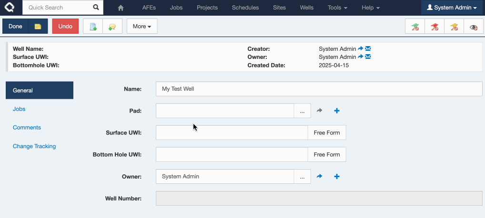

List fields in Execute typically have a `+` icon next to them as a shortcut to adding a new record of that type and automatically selecting it.

Historically, the pop-up "Quick Add" form was rather ugly.  It listed every field on the new record in alphabetical order.

In this release, the default is to use the first (default) tab for each document and only fall back to the weird alphabetical tab if there are no custom tabs defined.

So...  Adding a Pad from my Well now looks a whole lot nicer.

And if I'd like further control, you can create a special "Quick Add" custom tab and really dial it in!

