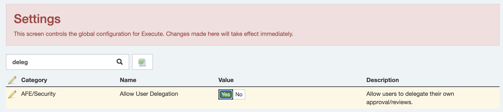

A often requested feature is to allow user's to delegate their own reviewers/approvers when they go on vacation, rather than requiring those requests to full through the system administrator.

A new setting will enable this functionality.

Once enable, user's will see a new option under their user menu (top right) to set out of office.

From here, users will get an out of office wizard that's almost identical to what the administrators are using today.

One note.  This functionality only makes sense in environments where users can be trusted to select their own delegates.  There is currently no rule system that ensures the selected user actually has authority to approve/review on behalf of the user.