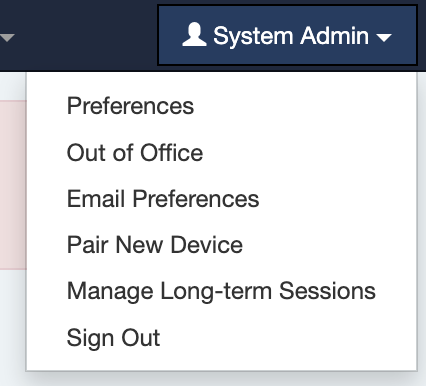

# Out of Office Delegation

A frequently requested feature is now available: users can delegate their own review or approval when they're away—without needing to go through a system administrator.

To enable this functionality, simply toggle the new setting:

Once enabled, users will see a new "Out of Office" option under their user menu (top right):

From there, users will be guided through a simple delegation wizard, similar to the one currently used by administrators.

> Note: This feature is best suited for environments where users are trusted to choose appropriate delegates. At this time, there is no rule system in place to validate that the selected delegate has the necessary approval or review authority.