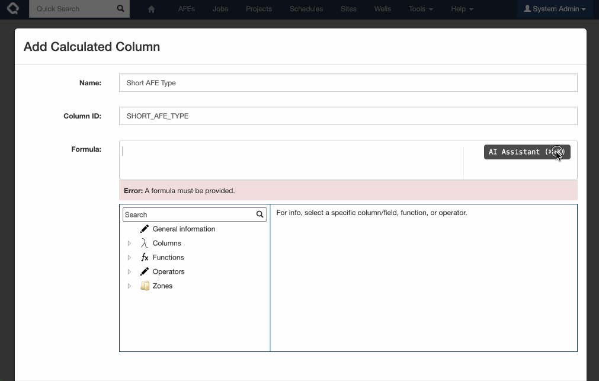
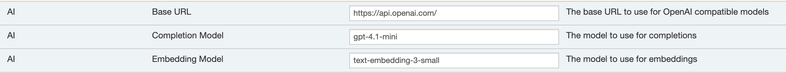

Execute's new AI Formula assistant makes building, updating and understanding formulas a breeze!

This functionality is available as a preview and **not-enabled** by default. 

To enable you must:
* Add the `ENABLE_AI` configuration flag under `Tools > Configuration > Settings`.
* Set up your AI provider in the Settings (OpenAI is the easiest and default option, but Azure AI works too)
  
* Add a new External Credential with your OpenAI / Azure AI API Key.  The credential must be called `AI_APIKEY`

**NOTE: By enabling this experimental feature you understand that some information about your Execute environment is being sent to your configured AI provider including a complete field list, and details about your formulas.**