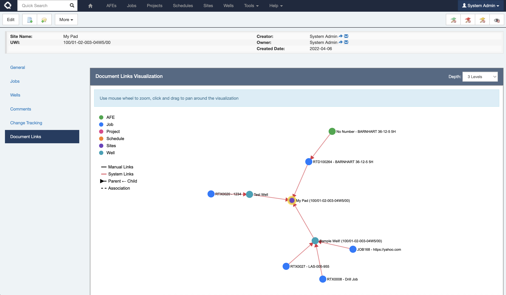

This adds a new visualization of how your documents are related to each other on the Document Links tab making it so much easier to navigate between related records.

**NOTE: If this feature doesn't make sense in your environment, you can disable it by setting the `HIDE_DOCUMENT_LINK_GRAPH` configuration flag in settings.**