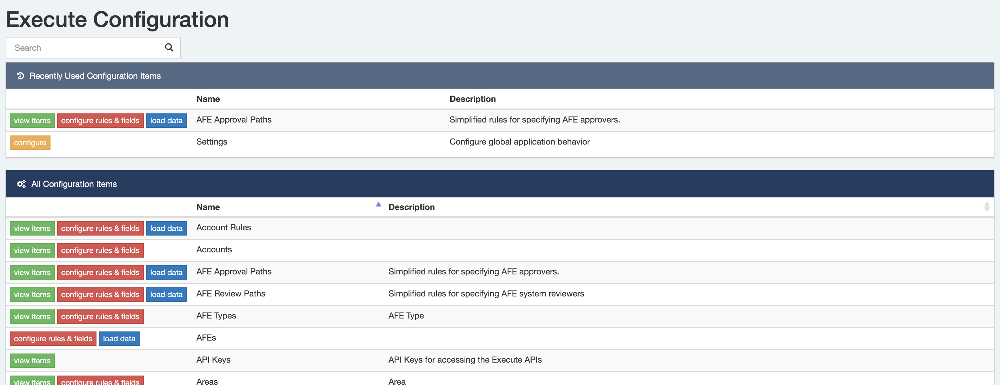

Some of us spend a lot of time in various settings/configuration screens in the app.  The Configuration page now shows you a list of your most recently accessed configuration pages on the top so you can spend a whole lot less time searching!

