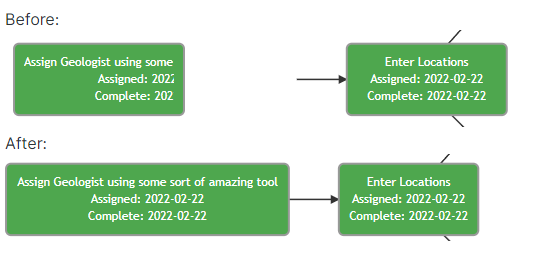
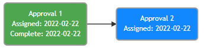

We've been working closely with several of you as you've rolled out the new Advanced Workflows and made some changes based on the feedback from that process.

### Tooltips

The tooltips on the workflow diagrams weren't particularly helpful and had an annoying tendancy to get stuck on your screen.  We've removed them.

### Workflow Diagram Box Sizing

Boxes on the workflow diagram now automatically adjust to the size of the task name.  This makes it easier to read the diagram and fixes the issue where the task arrows would render incorrectly.

### Assigned & Completion Date on Workflow Diagrams

We've added the Assigned and Completion date fields to the workflow diagram.

### Subworkflow Visualization

If your workflows make use of Subworkflows, we've made some huge improvements.  

1. Only the main workflows are listed on the Workflows tab on your Well/Site/Job.  This makes it much less confusing for end-users.
2. Active subworkflows show in a panel on the main workflow (see screenshot below), making it much easier to see what's going on and how the subworkflow relates to the main workflow.
3. Clicking on a subworkflow task will always bring you to the detailed diagram and task status page for that subworkflow.
4. Main workflows tasks and subworkflow tasks are shown together in the task list under the main workflow making it much easier for those involved in the workflow to find their tasks.

