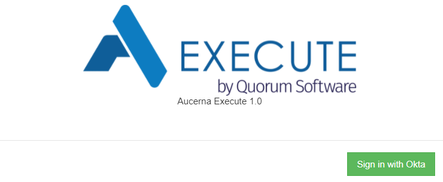

We all have way too many passwords to manage.  IT departments have too many systems to manage (onboarding, offboarding, enforcing policies, etc.).

Aucerna Execute has long supported integration with Active Directory for on-prem installations of Aucerna Execute.  This allowed users who were already logged into the domain to automatically login to Aucerna Execute without needing to set and remember yet another password.  It also simplified management for IT groups because some user properties would automatically sync between the domain controller, and Aucerna Execute.

In this release we add optional support for integration with [Okta](https://www.okta.com/) which allows domain federated sign-on with Quorum hosted Aucerna Execute environments.

This functionality is typically configured by the Quorum Application Delivery team (with input from client IT departments).  More information on this is available [in the Aucerna Execute Documentation](https://hedgedoc.straybits.org/s/sBfq_Hesu).