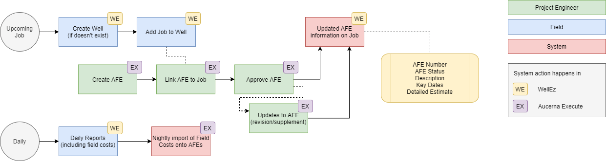

Those of you using [Quorum's WellEz](https://www.quorumsoftware.com/upstream-on-demand/wellez), or thinking about switching to WellEz, can now integrate your Aucerna Execute AFE process and WellEz.

* AFE Owners (in Aucerna Execute) - Ensure timely (nightly) access to spending (field costs) for their AFEs. This information helps AFE owners stay on top of their AFEs, more easily identify issues, and take corrective actions (supplementing the AFE, for example) sooner.
* AFE Owners (in Aucerna Execute) - When accrual time comes, AFE owners will laugh with glee (or at least be pleasantly surprised) because up-to-date field costs and actuals are collected in one system, making it easy for them to review their accruals, apply adjustments, and submit their accruals, without needing to wrangle data in Excel.
* Field Staff (in WellEz) - Ensure visibility into the latest approved AFE estimate for Jobs in WellEz. This helps field staff ensure that they (a) have an approved AFE before starting work, (b) raise the alarms if field tickets/spending are out of whack with AFE estimates.
* Ensure that WellEz and Aucerna Execute users can run Budget v. Spend comparisons in their systems to identify trends and systemic problems estimating AFEs.

Here is a rough workflow diagram describing the interaction between the two systems:
