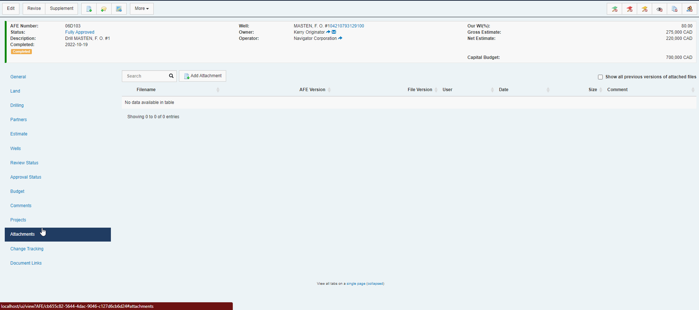

To improve performance when viewing Change Tracking for documents with a LOOONG history of changes, we have modified the default behaviour to only show/load detailed history for 6o days.  

If you'd like to see the full history, there is a handy "Load History" button which will load everything, just as before.

We've done our best to make sure it's clear when you are viewing a partial history (or searching partial history) to avoid any confusion.

Here is how it all looks.

