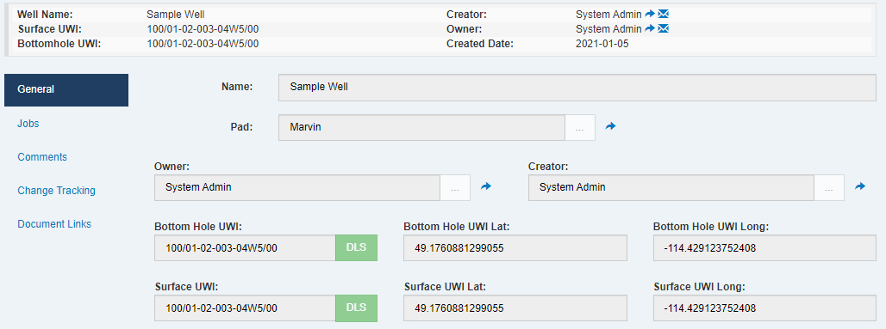

Something we've been asked for **a lot** ever since Execute was reborn as a web-based application was the ability to stick fields side-by-side on your custom tabs.  Here it is!

You configure your custom tabs just as you always have, but now there is a new "Same row as Above" checkbox in your tab configuration, which you can use to indicate that the field should share a row with the field above it.  Currently, you can have up to 4 fields share a single row.

