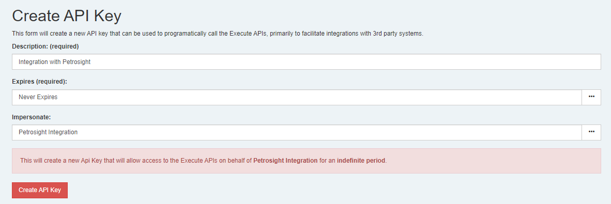
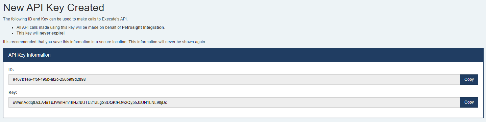
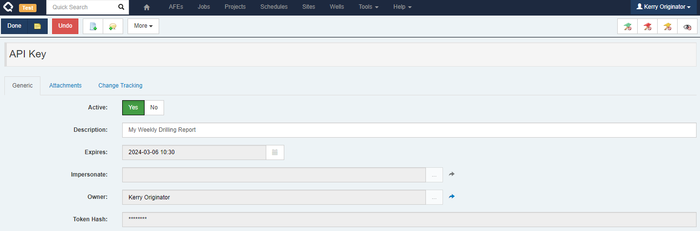
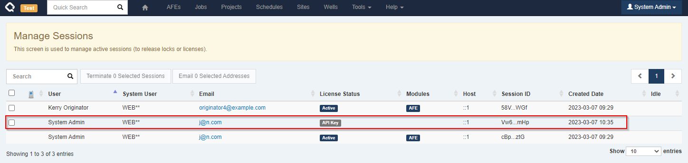
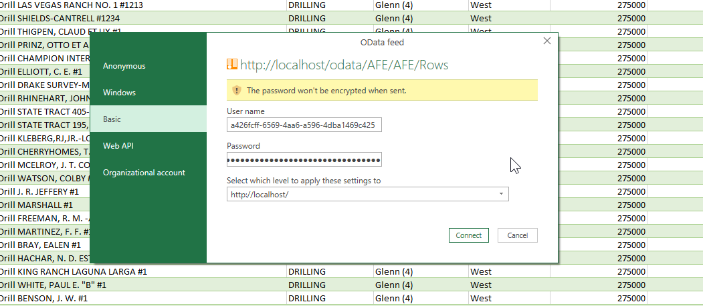

We've added the ability to create API Keys to Execute to make it easier/safer to write integrations against the Execute APIs.

1. By default, only admins can create a new API key.
2. Sessions created using an API Key do not consume or require a license.
3. API Keys can be set to expire (user-created API Keys must expire within one year).
4. API Keys work much better in an environment that doesn't have passwords (i.e., SSO users).

## The Problem

Execute has a great set of APIs that many of you use to build integrations between Execute and other systems. Unfortunately, to use these Execute APIs, you needed to create a session using a username and password and the normal login API (used by the app itself). This raises several problems:

1. It Doesn't work well for environments that use SSO and don't have passwords.
2. Execute's normal sessions consume/require a license. This requirement means that integrations start failing when the system is busy because they can't get a license. It also means that for clients with small numbers of licenses, a long-running integration may lock people out of the system.
3. Execute's default 2-minute timeout on a session can break long-running integrations.

## What is an API Key?

In Execute, an API key is an additional credential that can be used to log into the Execute APIs (or OData) to facilitate integrations. It's like an additional username and password that are machine-generated (long and secure). Creating a session using an API Key does not consume a license and is more robust than the old-style login.

## Creating an API Key

API Keys are managed under `Tools > Configuration > API Keys`.

It is always a best practice to create unique API Keys for each service/integration to simplify phasing out old credentials or replacing compromised ones.

### Admin API Keys

Users with the new `Manage API Keys` privilege are *always* able to add new API Keys using the `Create API Key` button on the top of the API Keys screen.



* A **description** is always required for an API key and should describe what the key is being used for. A good description might be something like "Integration with Petrosight" or "Data Warehouse"
* You must define when the key **expires**. Administrators can create API Keys that never expire.  
* An admin may also configure the key to **impersonate** another user. Doing so means that all APIs called using the new API Key will operate as if the impersonated user was calling them. Impersonation is commonly required so an admin can set up an API key for a service account in Execute that they can't log into directly. 



Once created, you need to note the `ID` and the `Key` as both are required to use the APIs. The `Key` will never be shown again. The `ID` is just the DocumentID for the newly created `API Key` document and is not a secret.

### Non-admin API Keys

By default, non-admin users can NOT create new API Keys. You can permit users to create API Keys by toggling the new `Allow non-admin users to create API Keys?` setting to "Yes".

The typical use-case for non-admin self-serve API keys is to support OData use in password-less environments.  Alternatively, if only a few users need API Keys, administrators can create API Keys that impersonate that user, and then securely share the `Id` and `Key` with the user.

When permitted, users can create a new API Key (for themselves) using the `Create API Key` button at the top of the API Keys screen.


* A **description** is always required for an API key and should describe what the key is being used for. A good description might be something like "OData Summary Report" or "Data Warehouse"
* You must define when the key **expires**. Non-admin users can set a maximum expiry of 1 year. 
* Non-admin users can NEVER create API Keys that impersonate other users.


As before, once created, you need to note the `ID` and the `Key` as both are required to use the APIs. The `Key` will never be shown again. The `ID` is just the DocumentID for the newly created `API Key` document and is not a secret.

## Viewing and Editing API Keys

Current API Keys can be viewed from `Tools > Configuration > API Keys`.


* Administrative users with `Manage API Keys` will see all API Keys across all users in the system
* Non-admin users will only see API Keys that they created and those created by other users that impersonate them



Either the owner of an API Key or an admin can change an API Key, but those changes are limited to:

1. Toggle the "Active" flag on an API Key (temporarily enable/disable it)
2. Deleting the API Key
3. Updating the API Key description

Once an API Key is created, there is no way to change the user to impersonate or the expiry time.

## Managing API Sessions

When an API Key is in use, administrators will see it under the `Manage Sessions` screen, where they can terminate it if required.



**API Sessions are different**

* Only a single active session is permitted for an API key (whereas you can log in multiple times with a username/password)
* API Key sessions timeout after an hour instead of the usual 2 minutes
* API Key sessions do not consume a license

Because of the above, the primary reason to terminate an API Session is if it was accidentally left open and you'd like to terminate it so a new session can be created and any locks it holds can be released.

## Using an API Key with Execute

API Keys can be used to call Execute's APIs, and can also be used for OData.

### APIs

Calling any Execute APIs requires you have a valid session.

To create a new Execute session using an API key, call the new `/api/Authentication/ApiKey/Login` API instead of the previous `/api/Authentication/Login` API.

The arguments to this API are simply the ID and Key obtained when creating the API Key.

```
{
  "Id": "a426fcff-6569-4aa6-a596-4dba1469c425",
  "Key": "SK9EwPMwMX4CYKMX6Xc7JMchJp5ZyWEUdAIni5V3OwS6nLfAHZJHrKd8vnruIBnD"
}
```

The response from the ApiKey/Login call is identical to the normal login call. If the API Key impersonates a user the session will be created as that user.

### OData

The new API Keys can also be used to connect to OData for environments/situations where the normal username and password is not appropriate.


