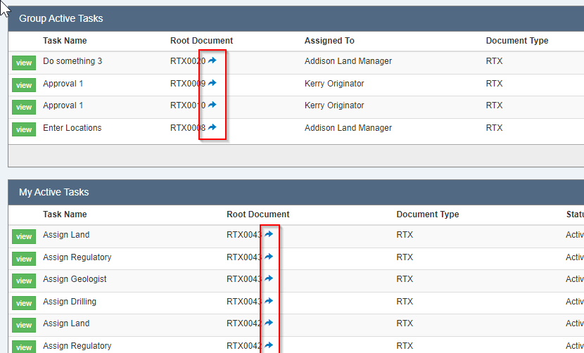

If you are using Execute's Advanced (Task-based) Workflows, to help guide the workflow for an AFE or a Job, it turns out it wasn't easy to find your way back to the underlying AFE/Job if you wanted to see the whole picture.

In this update, we've added helpful little icons in the "My Active Tasks" and "Group Active Tasks" widgets that will bring you directly to the root document.

Similarly, there was no way to open the root document once you were viewing a task (either by clicking the "view" button next to the task in the dashboard, nor by clicking the link in the email), so we added those too.

