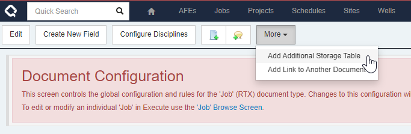

When you add custom fields to Execute, they are typically added to a single `_CUSTOM` table.  It turns out that there is a maximum number of columns supported in a table (it varies by database configuration) but it's roughly around 1000.  This can be a problem for organization implementing many RTx-type workflows.

To alleviate this, you can now add additional storage tables in Execute from a document's configuration page.

In this example, we're adding a new storage table for fields related to our abandonment process.  We could also just call it Custom 2 if we don't want to separate fields by type.

Once created, new fields can be added to the new table by selecting it as the "Record" when adding a new field.

