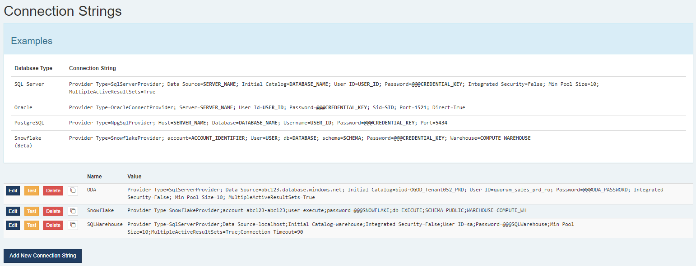

Database connection strings can be managed by an admin with the "Edit External Credentials" privilege under `Tools > Configuration > Connection Strings`.  New connection strings can be defined here and then referenced in your plugin files (rather than embedding database connection strings right in the plugin).    

**This is now the preferred way to manage database connections made directly from Execute to another system (Integration Agent connections are still managed separately).**

* Multiple plugins can refer to the same connection string instead of a separate copy in every file
* The connection strings can be edited without restarting the Execute service (plugin file changes still require a restart)
* Connections can be tested from the UI, rather than having to restart the service and trying to operate the plugin before learning if the connection actually works
* These connection strings still support the @@@ notation for using the separate credential storage feature.  It is recommended to use that for passwords, to ensure they are securely stored.



Most plugins that contain a connection string, such as this:

```
<ConnectionString>account=abc123-abc123;user=secureuser;password=securepassword123;db=EXECUTE;SCHEMA=PUBLIC;WAREHOUSE=COMPUTE_WH</ConnectionString>
<ProviderType>SnowflakeProvider</ProviderType>
```

Can then be updated to refer to the defined connection string like so.  Note: The "ProvideType" is now captured in the connection string and should be removed from the plugin file.  

```
<ConnectionString>Connection List=Server; Id=Snowflake</ConnectionString>
<ProviderType></ProviderType>
```

If you are migrating a plugin to an in-app managed plugin, you must move the connection string out of the plugin and into the connection string storage.

Please feel free to reach out to Execute Support if you need some help updating your existing plugin files to use this new functionality.