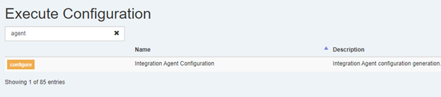

The Execute Integration Agent, which facilitates integrations between Quorum-hosted Execute and on-prem systems, is now packaged with Execute and will, in the future, automatically update itself as required.  

**If you are currently running the Integration Agent, however, you must manually update it as part of taking this Execute update.  If this step is not taken, integrations using the Integration Agent will be broken.**

You can download the latest Integration Agent installer from Execute's Tools > Configuration > Integration Agent Configuration menu.

You'll need to stop the current version of the Integration Agent (under your Windows Services panel).

You can then run the downloaded installer on the server hosting the Integration Agent and install the Integration Agent over top of your existing Integration Agent installation's root folder.

Note that because the installer was downloaded from the web, you may need to unblock it before you'll be able to run it by right clicking the downloaded file, selecting Properties, and then Unblock.

