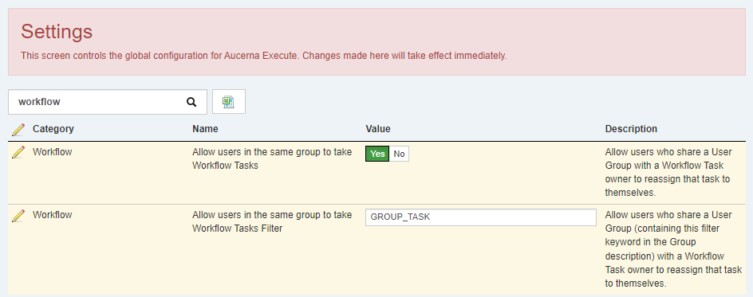
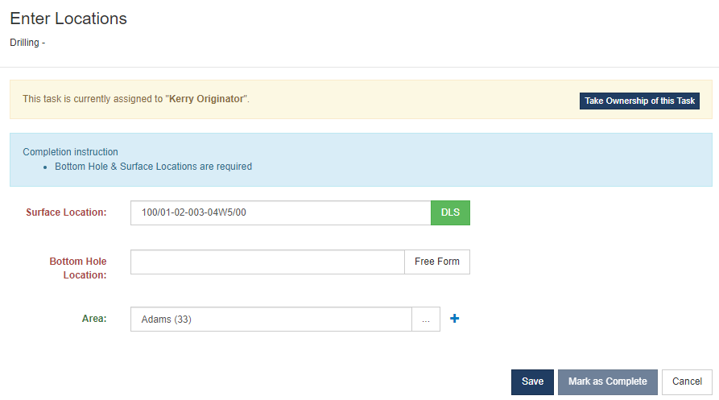

Workflow Tasks in Execute are assigned to a single user through that task's "Assigned To" rule. In some cases, however, this individual approach is too restrictive. i.e.

* "While Bob is on vacation other members of Bob's team would like to be able to see and complete tasks assigned to Bob."
* "A Task needs to be completed by someone in the Land Group (Alice, Bob and Eve) but we don't care who in particular."

We've introduced a new couple of new settings and a new feature to make this a breeze.

When enabled users who share an eligible* "User Group" with the owner of a task will be allowed to "Take Ownership of Task" and complete the work (using the button they'll see when viewing the task).

In addition, a new Dashboard Widget ("Group Active Tasks") makes it easy for Team member to see all the active Tasks that they could participate in.

