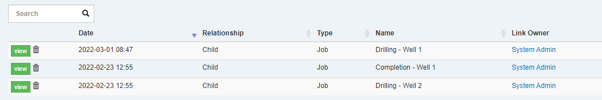

We've added some cool new functions to the formula language used for calculated fields and calculated report columns.  These include functions for dealing with table data (Min/Max/Count), and linked documents.

## Table Functions

The following new functions make it possible to summarize table data from a formula.  

* `TableMinDate`/`TableMaxDate` - return min/max of a date column in a table
* `TableMin`/`TableMax` - return min/max of a numeric column in a table
* `TableSum` - return sum of a numeric column in a table
* `TableCount` - return row count of a table 

If, for example, we have a table like this:


We can build a formula to retrieve the maximum depth with this formula:

```
TableMax("CUSTOM/GEOPROG","EST_TD")
```

Or we can return the number of GeoProg rows with:

```
TableCount("CUSTOM/GEOPROG")
```

## Document Link Functions

Document Links are a great way of linking records in Execute (such as linking Jobs and AFEs together).  We've added new functions that allow navigating these links from a formula to make it easy to fetch related information from another document in the system.

The new functions added are:

* `DocumentLinkChildrenMinDate`/`DocumentLinkChildrenMaxDate` - return min/max of a date field on linked documents of a certain type
* `DocumentLinkChildrenMinDateFiltered`/`DocumentLinkChildrenMaxDateFiltered` - same as above with filtering on a single column
* `DocumentLinkTextValueFiltered` - return a single text value from a linked document meeting a single column filter 
* `DocumentLinkDateValueFiltered` - return a single date value from a linked document meeting a single column filter 

Here I have a document linked to three Jobs (2 drilling and 1 completion):



We can build a formula that will retrieve the first (minimum) Spud date from linked Drilling Jobs with:

```
DocumentLinkChildrenMinDateFiltered("RTX","CUSTOM/SPUD_DATE","RTX_TYPE/DESCRIPTION","Drilling")
```

Or we could build a formula to retrieve the pad construction date from the linked Construction job with:

```
DocumentLinkDateValueFiltered("RTX","CUSTOM/CONSTRUCTION_DATE","RTX_TYPE/DESCRIPTION","Pad Construction")
```